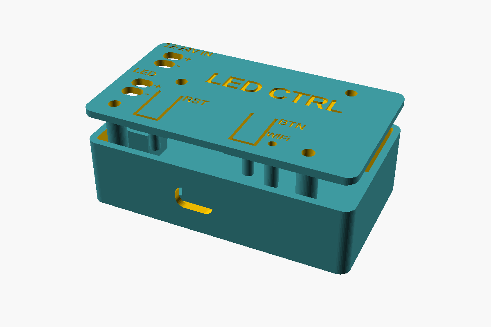
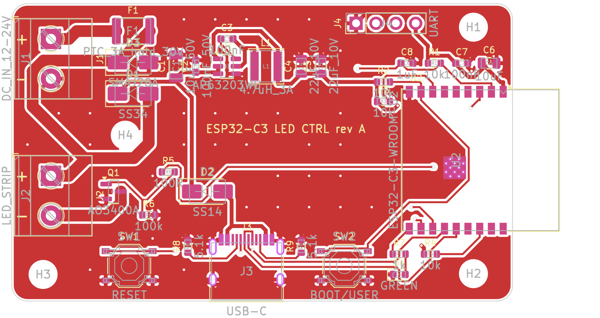
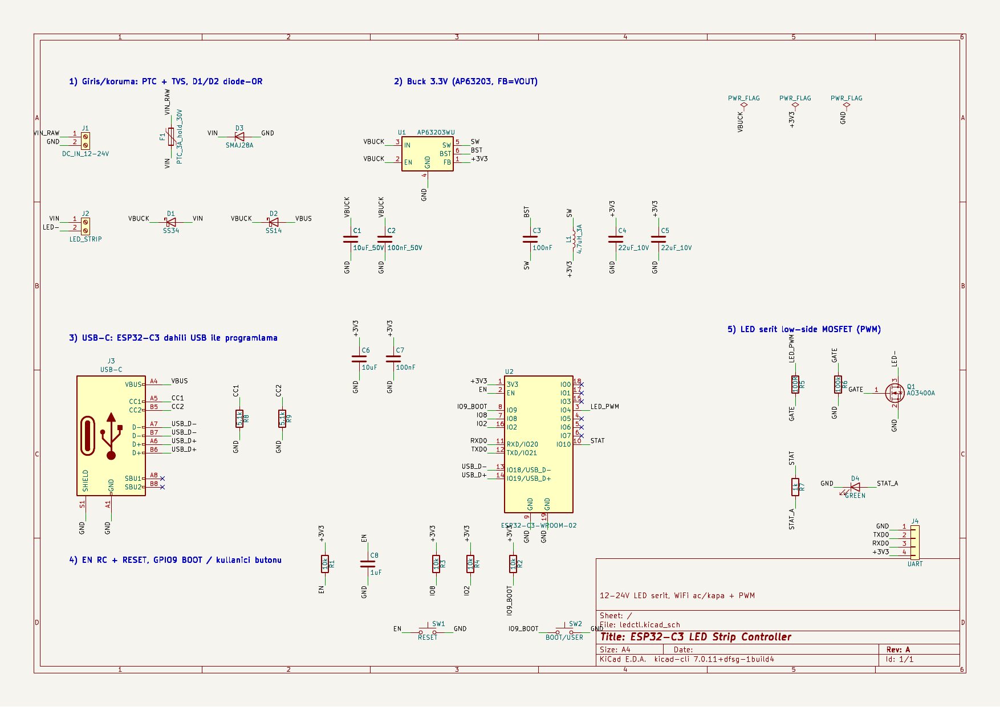

# ESP32-C3 LED Şerit Kontrolcüsü

12–24 V LED şeritleri WiFi üzerinden açıp kapatan ve PWM ile dimleyen küçük bir kontrol kartı. Proje KiCad donanım dosyalarını, iki firmware seçeneğini (ESPHome / PlatformIO) ve 3D yazıcıyla basılabilen bir kutuyu içerir.



| PCB üst | Şematik |
|---|---|
|  |  |

## Özellikler

- **Kontrol:** ESP32-C3-WROOM-02 (WiFi + BLE). Programlama dahili USB üzerinden USB-C ile yapılıyor, ayrı bir USB-UART çipi yok.
- **Giriş:** 12–24 V DC. PTC sigorta ve TVS ile korunuyor. AP63203 buck regülatör 3.3 V üretiyor.
- **Besleme:** D1/D2 diyotlarıyla kart adaptörden **ya da** sadece USB'den beslenebiliyor, yani programlarken adaptör gerekmiyor.
- **LED sürme:** LED şeridini low-side AO3400A MOSFET anahtarlıyor. 20 kHz PWM kullanılıyor, böylece duyulabilir vızıltı olmuyor. Gate'teki pull-down sayesinde LED boot sırasında kapalı kalıyor.
- **Arayüz:** RESET butonu, BOOT/kullanıcı butonu ve durum LED'i var.
- **Kart:** 64 × 38 mm, 2 katman, 4 × M3 montaj deliği.

## Klasör yapısı

```
hardware/          KiCad projesi (şematik, PCB, proje sembol kütüphanesi)
  BOM.csv          malzeme listesi (örnek parça numaralarıyla)
  ledctl-gerbers.zip   üreticiye (JLCPCB/PCBWay vb.) doğrudan yüklenebilir
  fabrication/     Gerber, drill, pick-and-place (pos) dosyaları
  scripts/         şematik/PCB'yi üreten Python betikleri (design.py = tek kaynak)
firmware/
  esphome/         Home Assistant için ESPHome konfigürasyonu
  platformio/      bağımsız Arduino firmware'i (web arayüzü + REST API)
    prebuilt/      derlenmiş factory imajı (0x0 adresine yazılır)
enclosure/         OpenSCAD kaynak + basılmaya hazır STL'ler
docs/              şematik PDF, PCB montaj PDF'i, görseller
```

## Pin haritası

| GPIO | İşlev |
|---|---|
| IO4 | LED PWM → R5 → Q1 gate |
| IO9 | BOOT / kullanıcı butonu (aktif düşük) |
| IO10 | Durum LED'i (aktif yüksek) |
| IO18 / IO19 | USB D− / D+ (USB-C) |
| IO20 / IO21 | UART RX / TX (J4, opsiyonel) |

## Firmware

### Seçenek A: ESPHome (Home Assistant)

```bash
cd firmware/esphome
cp secrets.yaml.example secrets.yaml   # WiFi bilgilerini gir
esphome run ledctl.yaml                # ilk yükleme USB-C üzerinden
```

Bu seçenek Home Assistant'a "LED Serit" adlı, dimlenebilir bir ışık olarak eklenir. Butona basınca LED açılıp kapanır, durum LED'i WiFi bağlantısını gösterir.

### Seçenek B: PlatformIO (bağımsız)

```bash
cd firmware/platformio
pio run -t upload        # USB-C
pio device monitor
```

1. **WiFi kurulumu:** İlk açılışta kart `LedCtrl-Setup` adında bir WiFi ağı açar. Bu ağa bağlanıp açılan sayfadan kendi WiFi bilgilerini gir.
2. **Web arayüzü:** Kurulumdan sonra `http://led-ctrl.local` adresinden aç/kapat ve parlaklık ayarı yapılabilir.
3. **REST API:**
   ```bash
   curl http://led-ctrl.local/api/state
   curl -X POST http://led-ctrl.local/api/state -d '{"on":true,"brightness":60}'
   curl -X POST http://led-ctrl.local/api/toggle
   ```
4. **Buton:**
   - Kısa basış: aç/kapat
   - Basılı tutma: parlaklığı 100 → 75 → 50 → 25 → 10 sırasıyla değiştirir
   - 8 saniye basılı tutma: WiFi ayarlarını siler
5. **Durum LED'i:**
   - Sürekli yanık: bağlı
   - Yavaş yanıp sönme: bağlanıyor
   - Hızlı yanıp sönme: kurulum modunda
6. **Diğer:** Son durum NVS'e kaydedilir, elektrik kesilip gelince geri yüklenir. Ayrıca OTA güncelleme (ArduinoOTA) destekleniyor.

Hazır imajı yazmak için:

```bash
esptool.py --chip esp32c3 write_flash 0x0 firmware/platformio/prebuilt/ledctl-factory.bin
```

> **Yükleme başlamazsa:** **BOOT**'a basılı tutarken **RESET**'e bas ve bırak. Kart indirme moduna geçer. Normalde USB üzerinden otomatik reset yeterli olur.

## Kutu (3D baskı)

| Parça | Dosya | Baskı yönü |
|---|---|---|
| Gövde | `enclosure/ledctl_case_base.stl` | taban aşağıda |
| Kapak | `enclosure/ledctl_case_lid.stl` | yüzü aşağıda (dosya zaten bu yönde) |

- **Önerilen baskı ayarları:** PETG veya PLA, 0.2 mm katman, %20–30 doluluk. Destek gerekmiyor.
- **Montaj:** 4 adet **M3 × 20** vida kapaktan girer, PCB'yi sıkıştırır ve gövdedeki direklere tutunur. Vidalar plastiğe kendi yolunu açabilir; isteğe bağlı olarak `pilot_d = 4.0` ile heat-set insert de kullanılabilir.
- **Duvara montaj:** Tabanda 20 mm aralıklı iki anahtar deliği var, en fazla 8 mm başlı vida uygun. USB-C aşağı bakacak şekilde asılır.
- **Bantla montaj:** Taban tamamen düz olduğu için çift taraflı bantla da yapıştırılabilir.
- **Butonlar:** RESET ve BOOT butonları kapaktaki esnek dillerle basılır. Durum LED'inin ışığı kapaktaki tüpten görünür.
- **Terminaller:** Vidalarına kapaktaki deliklerden tornavidayla erişilir.
- **Ölçüler:** `enclosure/ledctl_case.scad` içindeki parametrelerden (tolerans, duvar kalınlığı, yükseklik) değiştirilebilir.

```bash
openscad -D 'part="base"' -o enclosure/ledctl_case_base.stl enclosure/ledctl_case.scad
openscad -D 'part="lid"'  -o enclosure/ledctl_case_lid.stl  enclosure/ledctl_case.scad
```

## Üretim

1. `hardware/ledctl-gerbers.zip` dosyasını PCB üreticisine yükle. Ayarlar: 2 katman, 1.6 mm, 1 oz bakır.
2. Montaj için `hardware/BOM.csv` ve `hardware/fabrication/ledctl-pos.csv` dosyalarını kullan.
3. ESP modülünün anteni kartın sağ kenarından yaklaşık 6 mm dışarı taşar. Bu bilinçli bir tercih: antenin altında bakır olmaması gerekiyor. Kutu bu taşmaya göre tasarlandı.

## Tasarım notları ve sınırlar

- **Akım:** AO3400A ile kart yaklaşık **3 A** LED akımı için uygun. 24 V'ta bu yaklaşık 70 W, 12 V'ta yaklaşık 36 W eder. Daha yüksek akım için daha güçlü bir MOSFET kullanılmalı ve LED izleri genişletilmeli.
- **Gerilim:** AP63203 en fazla 32 V girişe dayanır. 24 V adaptörlerde sorun yok. TVS (SMAJ28A) kısa süreli darbelere karşı korur, ama sürekli aşırı gerilimden korumaz.
- **Routing:** İzler Freerouting ile otomatik çizildi. DRC'de elektriksel hata yok, sadece kozmetik silkscreen uyarıları var. Sipariş vermeden önce KiCad 8/9'da ERC ve DRC'yi kendin de çalıştır.
- **Yeniden üretme:** `hardware/scripts/` içindeki betikler şematik ve PCB'yi `design.py` ve `placement.py` dosyalarından üretir. Bunun için KiCad 7+ Python (`pcbnew`) ve otomatik routing için Freerouting gerekir (`FREEROUTING_JAR` ortam değişkeni).

## Lisans

[MIT](LICENSE). Donanım dosyaları, firmware ve kutu dahil projenin tamamı bu lisansla yayınlanır.
